# Making Qwen-Image work on pixel space

The thing comes from here <a href="https://arxiv.org/pdf/2605.12013">L2P: UNLOCKING LATENT POTENTIAL FOR PIXEL GENERATION</a>, in this repo I've tried to follow the paper as colosly as possible in order to transfer the thing to Qwen-Image-2512 including the data generation and cleaning pipeline, though I have included bits from the <a href="https://www.krea.ai/blog/flux-krea-open-source-release">KREA.1 BLOG</a> specially in the cleaning and curating process, for which raw data has been uploaded on huggingface -  
<ul>
  <li><a href="https://huggingface.co/datasets/shauray/l2p-dataset">shauray/l2p-dataset</a></li>
  <li><a href="https://huggingface.co/datasets/shauray/l2p-part0">shauray/l2p-part0</a></li>
  <li><a href="https://huggingface.co/datasets/shauray/l2p-raw">shauray/l2p-raw</a></li>
</ul>
and the cleaned dataset of rougly 18k samples is uploaded here - <a href="https://huggingface.co/datasets/shauray/l2p-clean">shauray/l2p-clean</a> all the images are Qwen shaped, mostly 1328x1328 (area) though I'll use a 1024 resize for the training cause I plan on to finetune it on a subset of these images on the full res and then a 4K dataset - <a href="https://x.com/Shauray7/status/2063206068424151320?s=20">Post explaining the process on X</a>.
 

## Overfit run
Using 6/6 blocks rather then 3/3 used in the paper for Z-Image, from pure noise is a little soft but hey it was a small run, does plateau after a while but could be just a scaling thing. training more on low-noise steps does make it plateau a little later but it does plateau after a while. Tried muon on 2D attn/mlp weights and AdamW for embeddings, norm and decoder did not quite beat AdamW on my test runs - could be cause most of the work is being done by the detailer head here and Muon just doesn't finetune an Adam-pretrained model well. 
  
Some samples from the overfit run (gen|gt) - 
| Overfit Sample 1 | Overfit Sample 2 | Overfit Sample 3 | Loss Graph |
|:---:|:---:|:---:|:---:|
| 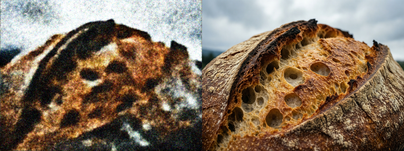 | 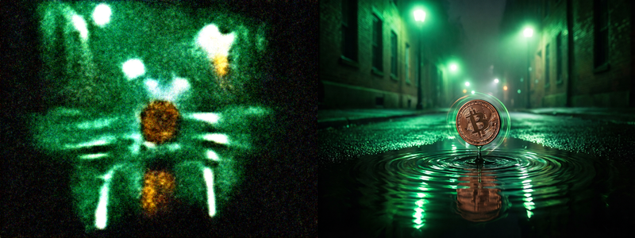 | 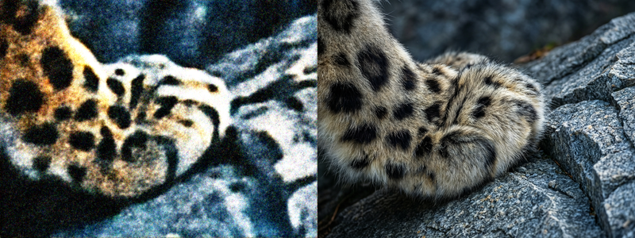 | 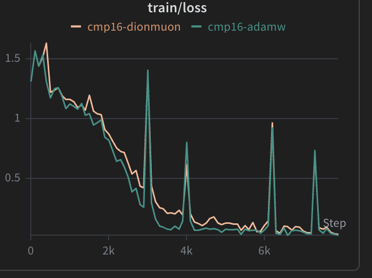 |

This was enough for me to verify that I have good hyperparams cause the paper does not really mention those clearly, they do mention some stuff on the ablation study table but had to confirm for myself and after this a long long data curation/cleaning pipeline started, generating 18k samples also i decided to keep 2 to 3 seeds of the same prompt for some samples in order to preserve whatever diversity I can though I'm not touching the mid layers at all so should not be a big problem 

## The transfer run (Latent space to pixel)
It's still on the GPUs, right now since I'm training on spot <a href="https://x.com/Shauray7/status/2068471656658633016">The X update</a> things are progressing pretty slowly since finding a GPU is pretty hard these days and finding a spot is even harder specially on the region I want, Ive been using 2xH200 on and off for a couple of days now 5600 steps done, BS=16, grad accum=1, the results look decent given that on the ablation studies they did 100k steps, BS=8, 8xH100, so my global BS is off by half but ehh should not matter that much on a run like this, right? 
 
here are the samples (gen|gt) - 
| Sample 2200 | Sample 3200 | Sample 4600 | Sample 5800 |
|:---:|:---:|:---:|:---:|
| 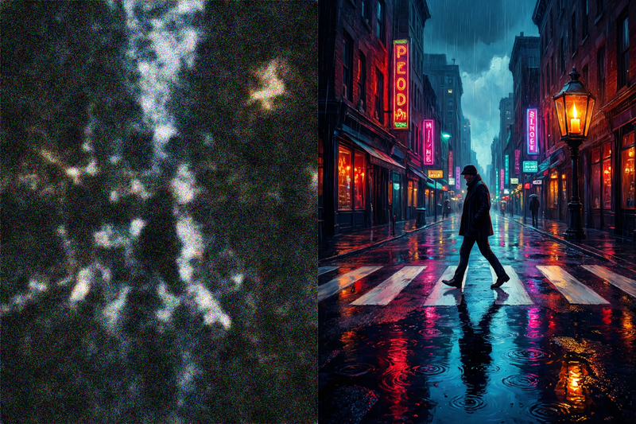 | 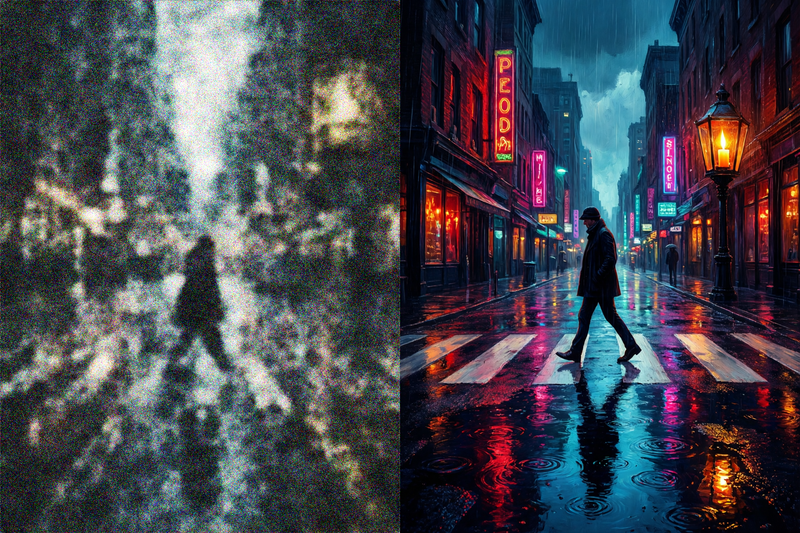 | 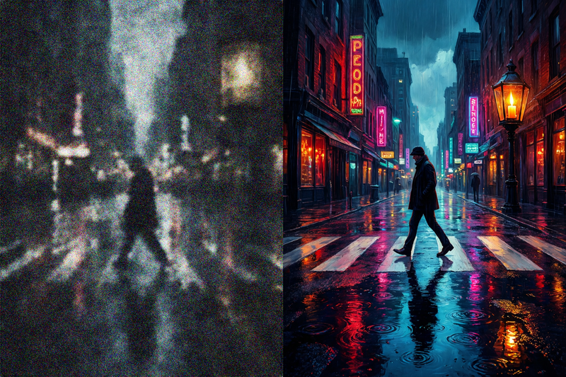 | 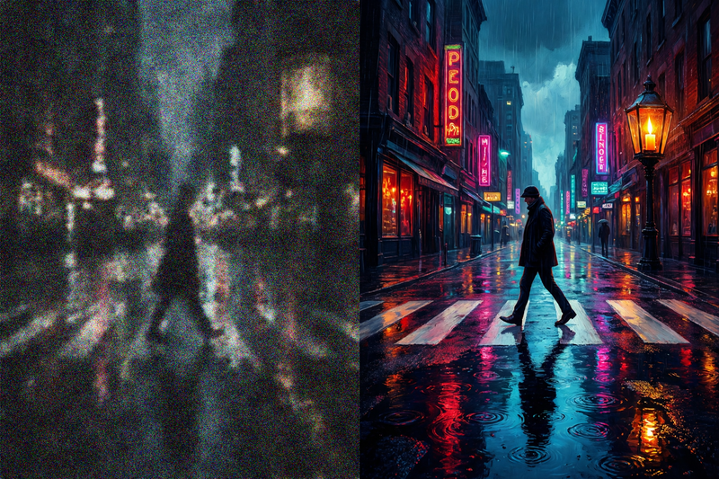 |
| 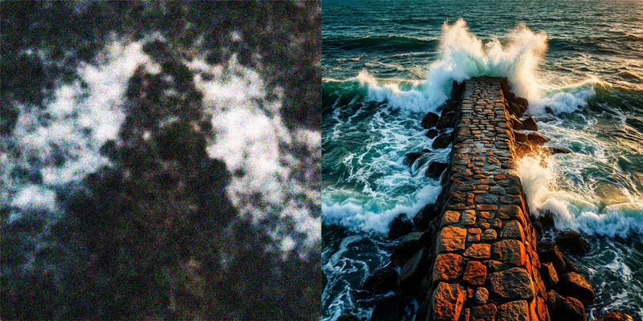 | 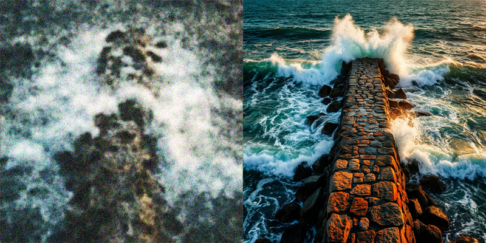 | 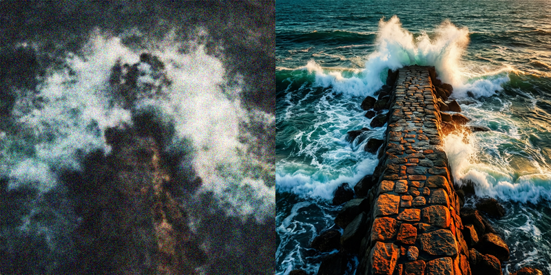 | 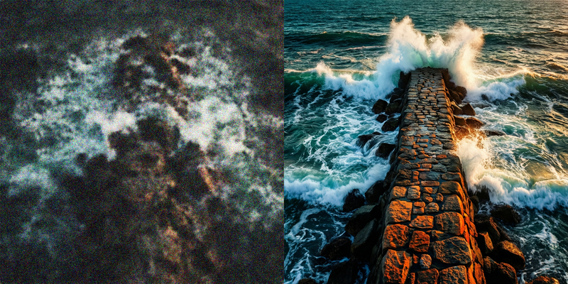 |

and here's the loss and the recon psnr curve -
| Loss | Recon PSNR |
|:---:|:---:|
| 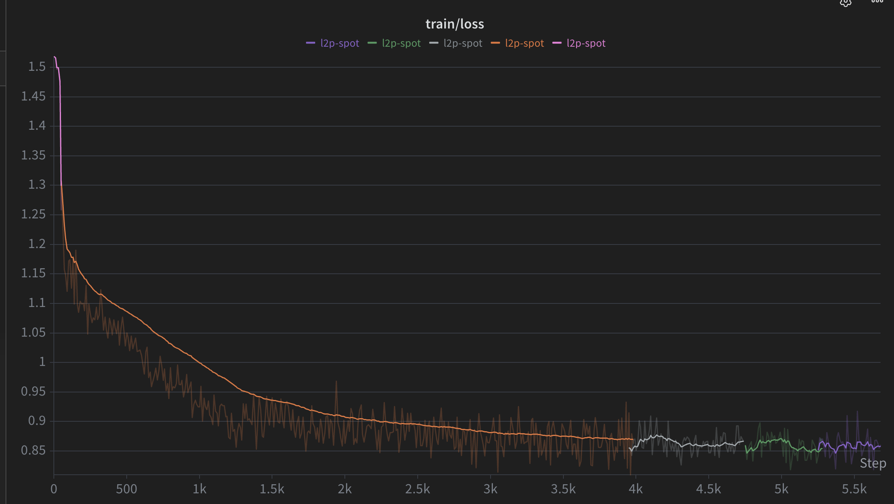 | 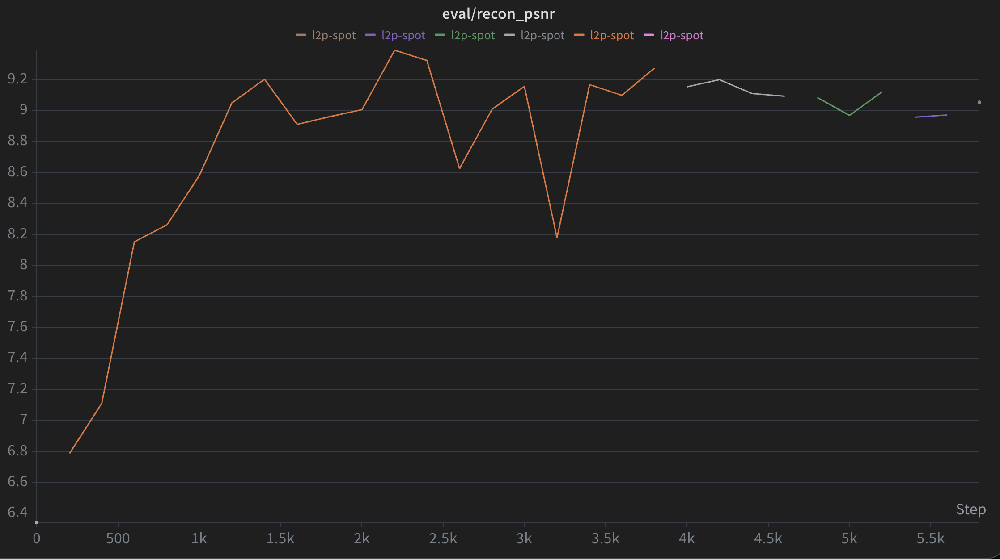 |

from here on It's just how fast and how much GPUs I get (btw I'm using verda), after which I'll start with the finetune runs on bigger resolutions and better aesthetics ! 
